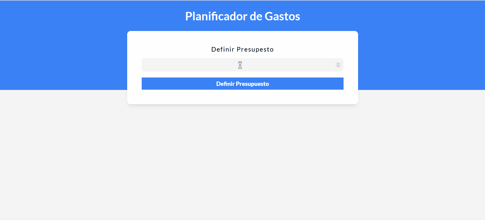

#Planificador-de-gastos

Este proyecto es una aplicación para el control de gastos personales desarrollada con Vue.js. 
Permite registrar, visualizar y gestionar los gastos de manera sencilla. La aplicación te ayudará a tener un mejor control sobre tus finanzas personales, ocio, salud, gastos, etc.

## Tecnologías Utilizadas

- **HTML5**
- **CSS3**
- **JavaScript**
- **Vue 3 + Vite**

# Vue 3 + Vite

This template should help get you started developing with Vue 3 in Vite. The template uses Vue 3 `<script setup>` SFCs, check out the [script setup docs](https://v3.vuejs.org/api/sfc-script-setup.html#sfc-script-setup) to learn more.

## Recommended IDE Setup

- [VS Code](https://code.visualstudio.com/) + [Volar](https://marketplace.visualstudio.com/items?itemName=Vue.volar) (and disable Vetur) + [TypeScript Vue Plugin (Volar)](https://marketplace.visualstudio.com/items?itemName=Vue.vscode-typescript-vue-plugin).
